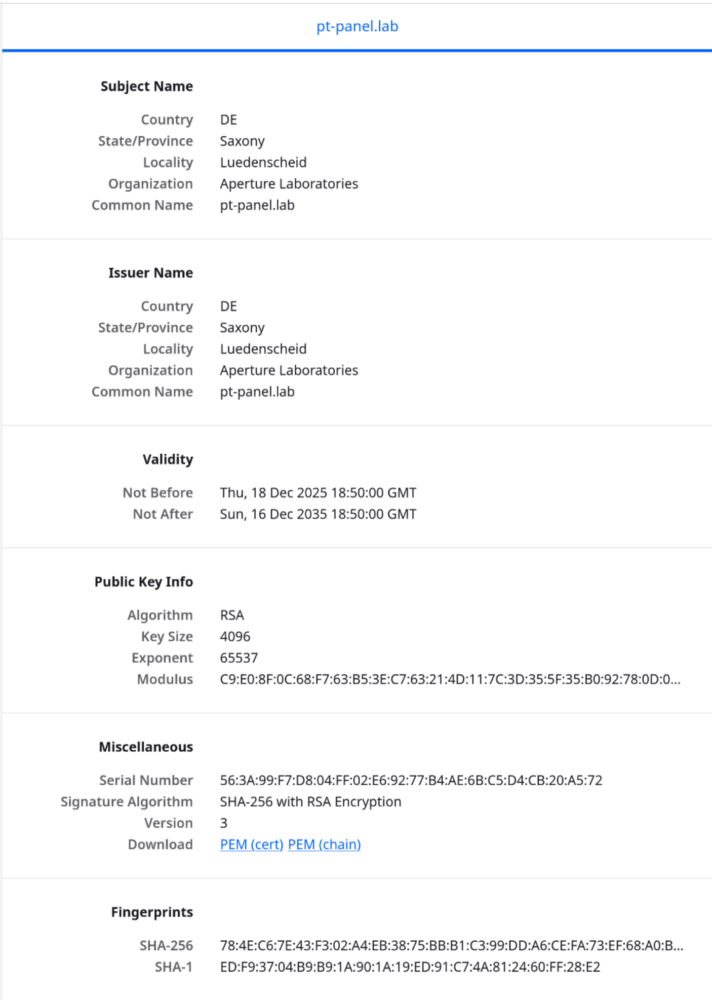

# SSL

Für SSL wird eine FQDN benötigt, um diese zu erstellen wird ein DNS server benötigt.

## DNS

Wir benötigen einen DNS-Server um FQDNs zu erstellen.
Als DNS-Lösung haben wir uns für PiHole entschieden
Der DNS wird mit auf dem Backup-Server mit installiert

### PiHole installation

```bash
git clone --depth 1 https://github.com/pi-hole/pi-hole.git Pi-hole
cd "Pi-hole/automated install/"
sudo bash basic-install.sh
```

Während der Installation wurden folgende angaben getätigt
```json
pihole-setup {
    Upstream-DNS: "Cloudflare (DNSSEC)",
    Blocklist use: True,
    Query Logging: False,
    Privacy Mode: "Anonymous Mode"
}
```

Generated PW is `x2c1isaH`

Für eine FQDN kann im Dashboard -> Settings -> Local DNS Records ein entsprechender Eintrag angelegt werden.

FQDN = `pt-panel.lab`

Die Systeme müssen noch konfiguriert werden, sodass sie den DNSserver benutzen

## Zertifikat

Für das Zertifikat wird OpenSSL genutzt. Mehr informationen hier --> ([OpenSSL - Ubuntu Server Documentation](https://documentation.ubuntu.com/server/explanation/crypto/openssl/))

Für SSL wird ein extra ordner benötigt. 

```bash
sudo mkdir -p /etc/ssl/pterodactyl
cd /etc/ssl/pterodactyl
```

Anschließend wird ein Zertifikat und ein key generiert.

```bash
sudo openssl req -x509 -nodes -days 3650 \
  -newkey rsa:4096 \
  -keyout pterodactyl.key \
  -out pterodactyl.crt
```

Als Common Name muss die FQDN gesetzt werden!

### Nginx Config

```bash
sudo nano /etc/nginx/sites-available/pterodactyl.conf
```

```nginx
# HTTP redirect to HTTPS
server {
    listen 80;
    server_name pt-label.lab;
    return 301 https://$host$request_uri;
}
server {
    listen 443 ssl http2;
    server_name pt-label.lab;

    root /var/www/pterodactyl/public;
    index index.php;

    ssl_certificate     /etc/ssl/pterodactyl/pterodactyl.crt;
    ssl_certificate_key /etc/ssl/pterodactyl/pterodactyl.key;

    ssl_protocols TLSv1.2 TLSv1.3;
    ssl_ciphers HIGH:!aNULL:!MD5;

    client_max_body_size 100m;

    location / {
        try_files $uri $uri/ /index.php?$query_string;
    }

    location ~ \.php$ {
        include snippets/fastcgi-php.conf;
        fastcgi_pass unix:/run/php/php8.3-fpm.sock;
    }

    location ~ /\.ht {
        deny all;
    }
}
```

Anschließend nginx neustarten

```bash
sudo nginx -t
sudo systemctl reload nginx
```

### Pterodactyl config

in der Evironment datei anpassen.
```bash
cd /var/www/pterodactyl
sudo nano .env
```

Folgende Variablen einbauen
```env
APP_URL=https://pt-panel.lab
SESSION_SECURE_COOKIE=true
```

Anschließend Speichern

#### Cache Leeren & Services neustarten

```bash
# Clear Cache
php artisan optimize:clear
php artisan config:clear
php artisan view:clear

# Restart services
sudo systemctl restart php8.3-fpm
sudo systemctl restart nginx
```

Nun sollte das Panel mit https erreichbar sein. Das Zertifikat sieht wie folgt aus:


# Firewall Setup

Als Firewall lösung wird ufw (uncomplicated firewall) verwendet.

Genutzte Docs: https://wiki.ubuntuusers.de/ufw/

## Install ufw

```bash
# Vorinstalliert bei UbuntuServer 24 LTS
sudo apt install ufw
```

## Status, Start, Stop

### Status abrufen

Standardmäßig ist ufw inaktiv. Um dies zu überprüfen `sudo ufw status` ausführen.
Ausgabe ist: `Status: Inaktiv`

### Firewall starten/stoppen

ufw kann durch `sudo ufw enable` gestartet werden.
Dadurch wird ufw auch als Dienst eingerichtet.

Um ufw zu stoppen und auch den Dienst aus dem autostart zu entfernen kann mit `sudo ufw disable` erreicht werden.

## Regeln

ufw verwendet ein 3-stufiges regelwerk, welches in 3 Konfigurationsdateien hinterlegt ist.

1. `/etc/ufw/before.rules`
2. `/var/lib/ufw/user.rules`
3. `/etc/ufw/after.rules`

Die Regeln in user.rules überschreibt before.rules und after.rules überschreibt user.rules

### Regel erstellen

Um regeln hinzuzufügen gillt eine recht einfache Syntax:
`sudo ufw allow|deny|reject SERVICE`

mit `allow` wird der jeweilige service erlaubt
mit `deny` wird der jeweilige service geblockt
mit `reject`wird der jeweilige service geblockt, aber der Absender des Pakets erhält eine Nachricht, dass das Paket abgelehnt wurde.

`SERVICE` kann dabei eine in *etc/services* genannten PRotokolle sein (POP3, HTTP, SSH, ...)

Bspw. um SSH zu erlauben: `sudo ufw allow ssh`

### Regelungen

Benutzte Ports unter Linux 
```bash
sudo apt install net-tools
sudo netstat -tunlp
```

#### Allowed
|App|Port|
|---|---|
|minecraft node|25565-25580|
|node_exporter|9100,39878|
|grafana|3000|
|prometheus|9090,39878,35304|
|redis|6379,6379,55532|
|DNS|53|
|ssh|22|
|HTTPS/nginx|443|
|php|33632,3306,6379,55532,33312,443|
|mariadb|3306,33632|
|wings|8080,2022,2194|

