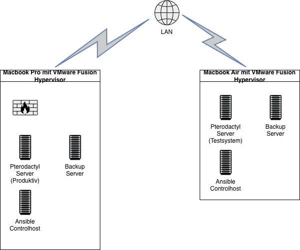

# Schutzbedarfsfeststellung - Pterodactyl - Minecraft Server

## Inhaltsverzeichnis

1. Die Projektgruppe
	1. Informationstechnik
2. Sicherheitsmanagement
3. Organisationsstruktur und Verantwortlichkeiten
4. Strukturanalyse
	1. Erfassung der Anwendungen
	2. Erhebung des Netzplans
	3. Erhebung der IT-Systeme
5. Schutzbedarfsfeststellung
	1. Anpassung der Schutzbedarfskategorien
	2. Schutzbedarfsfeststellung für Anwendungen
	3. Schutzbedarfsfeststellung für Kommunikationsverbindungen
6. Eigenmotivation
	1. Was habe ich gelernt?
	2. Wie kommt man zu dem Ergebnis?
	3. Wo findet man hilfreiche Informationen zu dem Thema?

## 1.  Die Projektgruppe
In diesem Dokument wird der erste größere Versuch unternommen das bereits durchgeführte Projekt (Pterodactyl-Server) nach der Variante "Basis-Absicherung" abzusichern und praktisch zu lernen, was es bedeutet mittels des Grundschutzkompendium das erschaffene System soweit abzusichern, wie unser kollektiver Wissenstand es ermöglicht.

Die Projektgruppe besteht weiterhin aus: Lucas, Robert und Luis

### 1.1 Informationstechnik
Es werden zwei MacBooks verwendet für die Verwaltung von Virtual Machines für das Testen und Vorführen des Projektes. Beide sind auf der neuesten macOS Version "macOS Tahoe 26.1" (Stand 04.12.2025). Alle Virtuellen Maschinen benutzen das Betriebsystem Ubuntu Version 24.04.3 LTS. Die Virtual Machines werden für folgende Zwecke eingesetzt:
- Ansible-Control-Host, der die Automatisierungs- und Konfigurationsverwaltung über Ansible ausführt,
- ein Produktivsystem für das Bereitstellen des Webinterfaces und die Verwaltungslogik für den Gameserver, 
- einen Backup-Server der automatisiert die Minecraft-Welten der Spieler sichert sowie andere relevante Daten,
- und einen Daemon-Server, der die Docker Container betreibt und einen Zugang für diese bereitstellt, sodass sich Nutzer nur auf den Docker Container verbinden können/müssen.

## 2. Sicherheitsmanagement
Umfassende Informationen zu den behandelten Themen und weitere Aspekten, die beim Aufbau eines Informationssicherheitsmanagementsystems zu berücksichtigen sind, sind in folgenden Dokumenten aufzufinden:
- BSI-Standard 200-1: Managementsysteme für Informationssicherheit (ISMS)
- BSI-Standard 200-2: IT-Grundschutz-Methodik
- IT-Grundschutz-Kompendium, Baustein ISMS.1 Sicherheitsmanagement und die zugehörigen Umsetzungshinweise

### 2.1 Projektstruktur und Verantwortlichkeiten
Unsere Gruppe (Robert, Lucas, Luis) beabsichtigt, ein Sicherheitskonzept auszuarbeiten, das für das Projekt umgesetzt werden soll um die Basis-Absicherung mindestens gewährleisten zu können, aufgrund unseres bisherigen Wissensstandes.

Im ersten Schritt haben wir Luis zum Informationssicherheitsbeauftragten ernannt, da er sich mit der Thematik IT-Grundschutz für das Projekt am meisten auseinandersetzt und die Fähigkeit hat das erlernte Wissen an seine Projektgruppe sinnvoll und in einem ausreichenden Maße weiterzugeben. 

##### Anmerkung
Da kein Unternehmen, sondern nur eine kleine Projektgruppe hinter dem Lernprojekt steht müssen keine Geschäftsprozesse, Räumlichkeiten, Abteilungen, etc. beschrieben und untersucht werden.

---
## 3. Ist-Stand 

### 3.1. Netzplan

### 3.2. IT-Systeme

In den Tabellen sind die IT-Systeme jeweils durchnummeriert.
Der Vorangestellte Buchstabe kennzeichnet jeweils ihren Typ (L = Laptop, S = Server (als VM), H = Hypervisor)

|Nr|Beschreibung|Plattform|Standort|
|---|---|---|---|